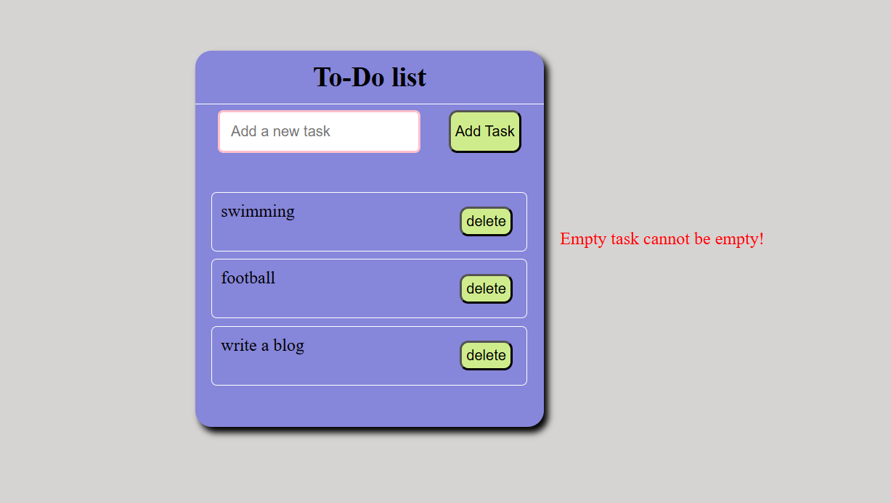

# 📝 To-Do List

A basic and responsive To-Do List web app built using **HTML**, **CSS**, and **JavaScript**. Users can add and delete tasks easily.

## 🚀 Features

- Add new tasks
- Delete existing tasks
- Error message for empty input
- Simple and clean design
- Mobile responsive

## 📁 Files Included

- `index.html` – main HTML structure
- `style.css` – for styling the layout
- `script.js` – contains task handling logic

## 💻 How to Use

1. Open `index.html` in any web browser.
2. Type a task in the input box.
3. Click **"Add Task"** to add it to the list.
4. Click **"delete"** to remove a task.

## 📸 Screenshot

```markdown

```

## 📱 Responsive Design

Works on desktop, tablet, and mobile screens using media queries.

---

Made with ❤️ using HTML, CSS, and JavaScript.
